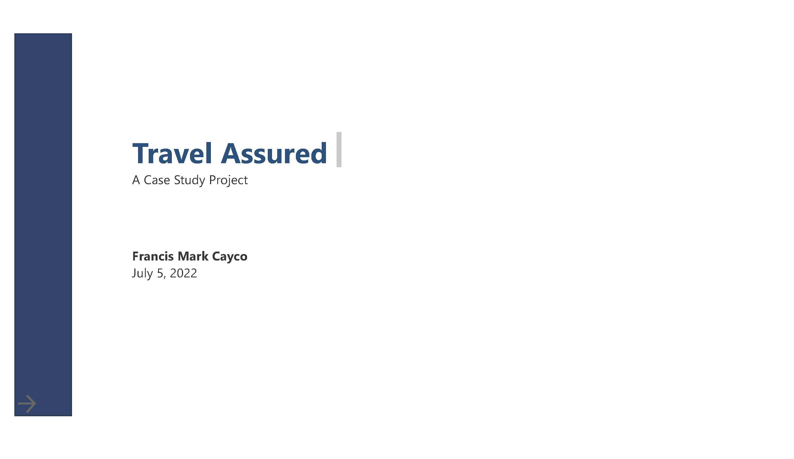

# Travel Assured: A Case Study Project

## Objectives
1.  Determine the usual amount of members within the family.
2.  Examine the trends on how age affects the amount of people who has an insurance.
3.  Differentiate travel behaviors on different employment types.
4.  Account for the threshold of customers' annual income where they'll start to use flights more frequently.
5.  Consider how chronic illnesses would affect their flying behavior.

*How likely would customers obtain an insurance based from number of members in a family?*
The chart on shows the number of members in a household is concentrated.  If we combine those who have an insurance and those who have not, almost a quarter of the respondents said that they are 4 in the family.
With an average of 4.75, we could say that in future marketing campaigns, we could launch packages that would cater families of sizes 4-5.

*How age affects people who have a travel insurance?*
Based from the graph, the amount of people who have a travel insurance decreases as they age.  There’s a big caveat for this.  Every around few years, specifically 3-5 years, there’s a noticeable spike on the number of people who have travel insurance.  My insight on this is that people only want to invest in travel insurances every certain period of time, not every year which results in decrease of travel insurance investment.
A good marketing strategy for this phenomenon is to attract customers in ages where the amount spikes as the data shows other wise.

*In terms of employment type, how does it affect travel behaviors?*
Available data shows that employment type is divided into two: government sector and private sectors.  Regardless of the travel behavior in terms of flying frequency and international travel, private sectors tend to have a diverse travel behavior.
Another analysis show that private sectors tend to have travelled internationally compared to those who are working for the government, probably due to the nature of their work as the graph below has a greater margin compared those to the graph above.
Those who have a travel insurance tend to has a noticeable travel behavior compared to those who have not. 

*Financial factors affecting flight behavior.*
This is the point where there is huge difference in travel behaviors when we take annual income into consideration.  Based on the percent of respondents, we could categorize the results into three based on where there is a noticeable change in the amount of customers that is a frequent flyer.  That is: lower, middle, and upper income.  
Lower income, those who earn less than 500k annually, does not fly frequently at all.
Meanwhile, some of our middle income customers around 20 – 40% of them fly frequently.  Which is very helpful in estimating our potential income in this group.
Those who earn around 1.5M yearly should be our main market, as they use flights frequently.
 Results also show similar when we factor whether the person has travel insurance or not, or is a graduate or not.
 

*What if we include chronic illnesses into consideration?*
Based from the available data, there is almost no distinction on customer flying behavior even if they have a chronic disease or not.  Whether they are a frequent flyer or not, or they haven’t travelled internationally, the percent of people who have chronic diseases still ranges from 20-30%.  Regardless they have a travel insurance or not.
Although less people have said that they have a chronic disease yet they are a frequent flyer and has already travelled abroad; and more people said its exact opposite. 

## Conclusions
- The number of members in a household usually ranges from 4 to 5 persons regardless of whether they have a travel insurance or not.
    *Therefore, what I would recommend is that create so-called ‘bundle’ packages that would most likely encourage families to inquire travel insurance for their own.*
- Based from the graph I’ve presented earlier, Customers tend to invest less in travel insurance as they age, although it spikes every 3-5 years.
*In relation to that, it would be a wise choice to make the validity of travel insurance to be at least 3 years so it would not be a burden for them to renew their insurances financially.*

- In direct relation to our third objective, which is how different sectors differ in terms of their travel behavior, private sectors tend to travel more frequently and globally than government sectors.
*Henceforth, we should offer more financial incentives to those who were employed in private companies, as it would most likely be more profitable for our insurance businesses.*

- Going on, customers with an annual income of more than $1.4M definitely travels frequently.  Consequently, only 10 to 30 % of the customers whose annual income ranges from 500K dollars to 1.4M dollars travel frequently.
*The main audiences of our travel insurance should be those who are in the upper financial spectrum, and offer high-class and elite packages with a variety of options to choose from.  We should also offer budget travel insurance packages for middle-income consumers, but make it sustainable since not all of them obtain a travel insurance.*
- Lastly, 20-30% of customers tend to have a chronic illnesses, but has little to no distinction on customer behavior.
*With regards to this, we should also offer optional health-related benefits within travel insurances since not most of them has a chronic illnesses.  Make the benefits uniform as there’s little effect on flying behavior.  Although we need more data on what diseases we should cover.*

